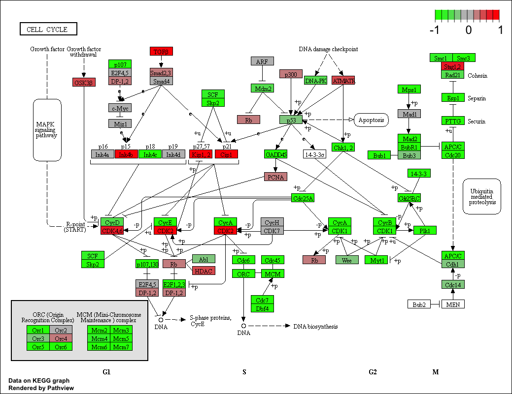
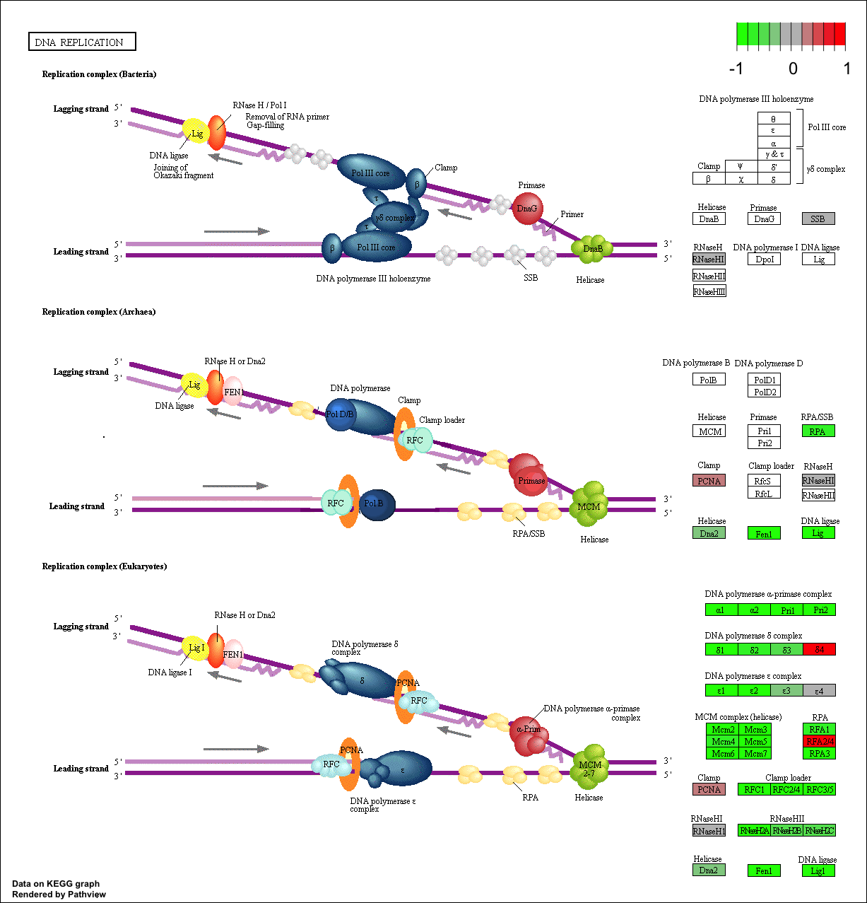

Download and read input data

The data for for hands-on session comes from GEO entry: GSE37704, which is associated with the following publication:

Trapnell C, Hendrickson DG, Sauvageau M, Goff L et al. "Differential analysis of gene regulation at transcript resolution with RNA-seq". Nat Biotechnol 2013 Jan;31(1):46-53. PMID: 23222703
The authors report on differential analysis of lung fibroblasts in response to loss of the developmental transcription factor HOXA1. Their results and others indicate that HOXA1 is required for lung fibroblast and HeLa cell cycle progression. In particular their analysis show that "loss of HOXA1 results in significant expression level changes in thousands of individual transcripts, along with isoform switching events in key regulators of the cell cycle". For our session we have used their Sailfish gene-level estimated counts and hence are restricted to protein-coding genes only.

```{r}
library(DESeq2)
```
```{r}
metaFile <- "data/GSE37704_metadata.csv"
countFile <- "data/GSE37704_featurecounts.csv"

# Import metadata and take a peak
colData = read.csv("GSE37704_metadata.csv", row.names=1)
head(colData)
```

```{r}
countData = read.csv("GSE37704_featurecounts.csv", row.names=1)
head(countData)
```
```{r}
countData <- countData[,-1]
```

```{r}
dim(countData)
```

There are genes that have zero counts in all samples (i.e. columns). We should remove these because we can't say anything about them.

First identify the zero sum rows:

Exclude these zero sum rows
```{r}
rowSums(countData) == 0
```

```{r}
inds <- rowSums(countData) != 0
countData <- countData[ inds, ]
```

```{r}
dim(countData)
```

## Running DESeq2

```{r}
dds = DESeqDataSetFromMatrix(countData=countData,
                             colData=colData,
                             design=~condition)
dds = DESeq(dds)
```

```{r}
res = results(dds)
```

```{r}
summary(res)
```

```{r}
plot( res$log2FoldChange, -log(res$padj) )
# Make a color vector for all genes
mycols <- rep("gray", nrow(res) )

# Color red the genes with absolute fold change above 2
mycols[ abs(res$log2FoldChange) > 2 ] <- "red"

# Color blue those with adjusted p-value less than 0.01
#  and absolute fold change more than 2
inds <- (res$padj < 0.01) & (abs(res$log2FoldChange) > 2 )
mycols[ inds ] <- "blue"

plot( res$log2FoldChange, -log(res$padj), col=mycols, xlab="Log2(FoldChange)", ylab="-Log(P-value)" )
```
```{r}
library("AnnotationDbi")
library("org.Hs.eg.db")

columns(org.Hs.eg.db)
```

Let's map our ENSEMBLE gene ids to the more conventional gene SYMBOL

```{r}
res$symbol <- mapIds(org.Hs.eg.db,
              keys=row.names(res), 
              keytype="ENSEMBL",
              column="SYMBOL",
              multiVals="first")
head(res)

res$entrez = mapIds(org.Hs.eg.db,
                    keys=row.names(res),
                    keytype="ENSEMBL",
                    column="ENTREZID",
                    multiVals="first")

res$name =   mapIds(org.Hs.eg.db,
                    keys=row.names(res),
                    keytype="ENSEMBL",
                    column="ENTREZID",
                    multiVals="first")
```
Save our annotated results
```{r}
write.csv(res, file="deseq_results_csv")
```

#pathway analysis

Here we are going to use the **gage** package for pathway analysis. Once we have a list of enriched pathways, we're going to use the pathview package to draw pathway diagrams, shading the molecules in the pathway by their degree of up/down-regulation.

Load these packages

```{r}
library(pathview)
library(gage)
library(gageData)
```

```{r}
data(kegg.sets.hs)
data(sigmet.idx.hs)

# Focus on signaling and metabolic pathways only
kegg.sets.hs = kegg.sets.hs[sigmet.idx.hs]

# Examine the first 3 pathways
head(kegg.sets.hs, 3)
```

Our input will be a vector of fold change values with ENTREZ gene ids as names
```{r}
foldchanges = res$log2FoldChange
names(foldchanges) = res$entrez
head(foldchanges)
```

```{r}
keggres = gage(foldchanges, gsets=kegg.sets.hs)
```

```{r}
attributes(keggres)
```

```{r}
keggres$less
```

```{r}
pathview(gene.data=foldchanges, pathway.id="hsa04110")

```


```{r}
data(go.sets.hs)
data(go.subs.hs)
# Focus on Biological Process subset of GO
gobpsets = go.sets.hs[go.subs.hs$BP]

gobpres = gage(foldchanges, gsets=gobpsets, same.dir=TRUE)

lapply(gobpres, head)
```

```{r}

```

```{r}
pathview(gene.data=foldchanges, pathway.id="hsa03030")
```

```{r}

```

```{r}
sig_genes <- res[res$padj <= 0.05 & !is.na(res$padj), "symbol"]
print(paste("Total number of significant genes:", length(sig_genes)))
```


```{r}
write.table(sig_genes, file="significant_genes.txt", row.names=FALSE, col.names=FALSE, quote=FALSE)
```

