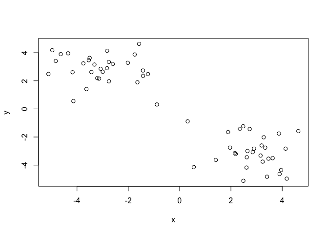
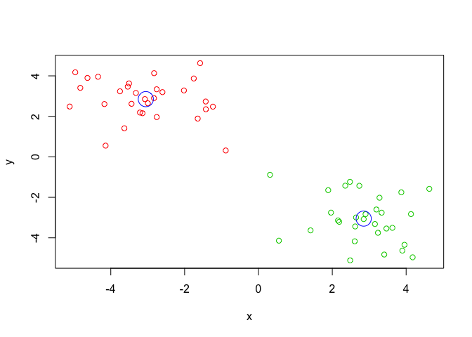
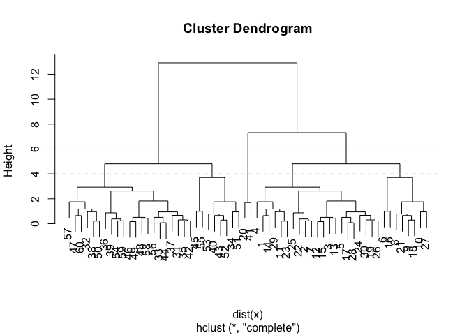
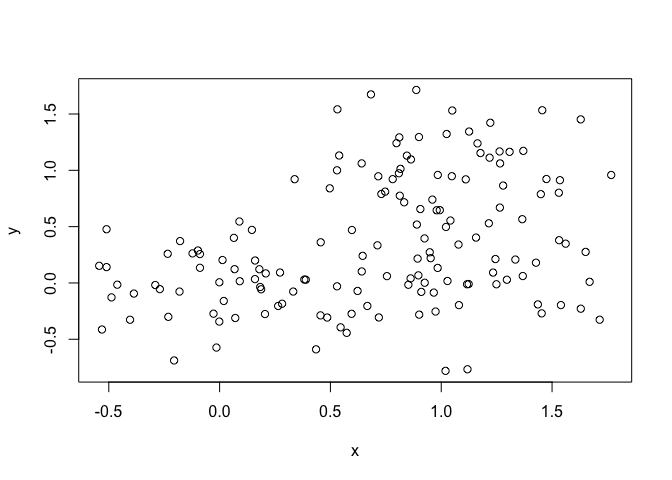
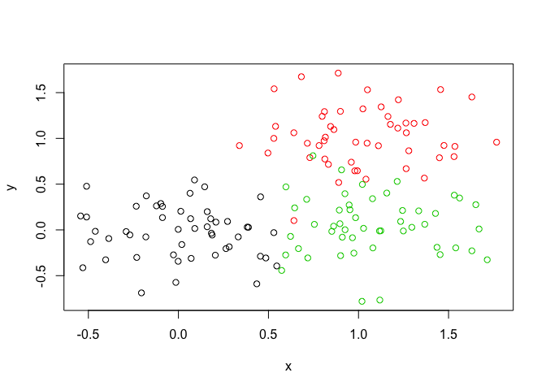
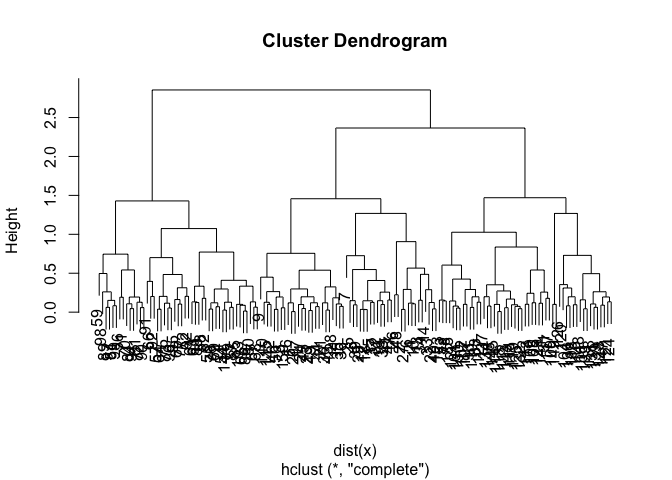
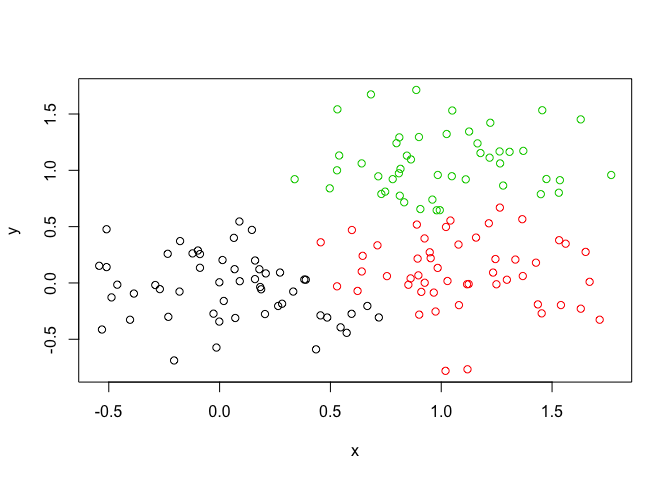
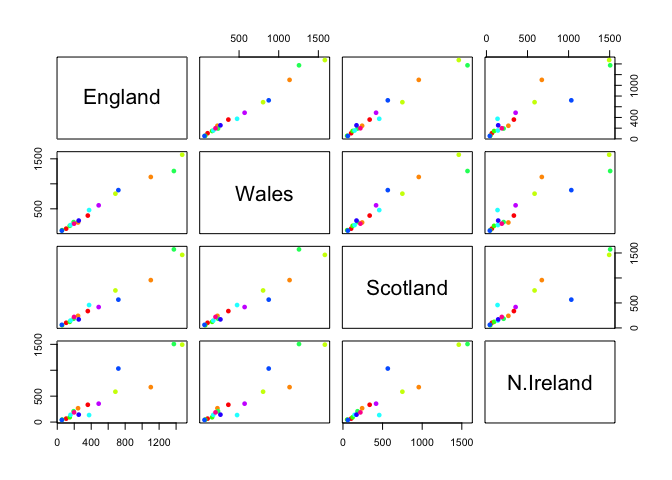
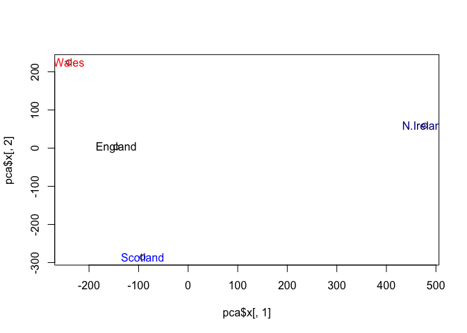
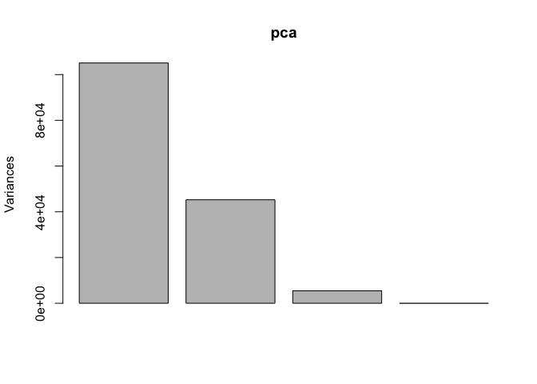

lecture 09
================
Sunyoung Lee
February 5, 2020

K-means clustering
------------------

Let's try the "kmeans()" function in R to cluster som emade-up example data

``` r
tmp <- c(rnorm(30,-3), rnorm(30,3))
x <- cbind(x=tmp, y=rev(tmp))

plot(x)
```

 Use the kmeans() function setting k to 2 and nstart = 20

``` r
km  <- kmeans (x, centers = 2, nstart = 20)
```

``` r
km
```

    ## K-means clustering with 2 clusters of sizes 30, 30
    ## 
    ## Cluster means:
    ##           x         y
    ## 1  2.833265 -2.942235
    ## 2 -2.942235  2.833265
    ## 
    ## Clustering vector:
    ##  [1] 2 2 2 2 2 2 2 2 2 2 2 2 2 2 2 2 2 2 2 2 2 2 2 2 2 2 2 2 2 2 1 1 1 1 1 1 1 1
    ## [39] 1 1 1 1 1 1 1 1 1 1 1 1 1 1 1 1 1 1 1 1 1 1
    ## 
    ## Within cluster sum of squares by cluster:
    ## [1] 56.67851 56.67851
    ##  (between_SS / total_SS =  89.8 %)
    ## 
    ## Available components:
    ## 
    ## [1] "cluster"      "centers"      "totss"        "withinss"     "tot.withinss"
    ## [6] "betweenss"    "size"         "iter"         "ifault"

what is in the output object `km` I can use the `attributes()` function to find this info

``` r
attributes(km)
```

    ## $names
    ## [1] "cluster"      "centers"      "totss"        "withinss"     "tot.withinss"
    ## [6] "betweenss"    "size"         "iter"         "ifault"      
    ## 
    ## $class
    ## [1] "kmeans"

Q. How many points are in each cluster?

``` r
km$size
```

    ## [1] 30 30

Q. what 'component' of your result object details - cluster size? - cluster assignment/membership? - cluster center?

``` r
km$cluster
```

    ##  [1] 2 2 2 2 2 2 2 2 2 2 2 2 2 2 2 2 2 2 2 2 2 2 2 2 2 2 2 2 2 2 1 1 1 1 1 1 1 1
    ## [39] 1 1 1 1 1 1 1 1 1 1 1 1 1 1 1 1 1 1 1 1 1 1

let's check how many 2s and 1s are in this vector with the "table()" function.

``` r
table(km$cluster)
```

    ## 
    ##  1  2 
    ## 30 30

Plot x colored by the kmeans cluster assignment and add cluster centers as blue points

``` r
plot(x, col=km$cluster+321)
points(km$centers, col="blue", pch=1, cex=3)
```



Hierarchical clustering in R
----------------------------

The `hclust()` function is the main Hierarchical clustering method in R and it **must** be passed a **distance matrix** as input not your raw data!

``` r
hc <- hclust( dist(x) )
hc
```

    ## 
    ## Call:
    ## hclust(d = dist(x))
    ## 
    ## Cluster method   : complete 
    ## Distance         : euclidean 
    ## Number of objects: 60

``` r
plot(hc)
abline(h=6, col="pink", lty=2)
abline(h=4, col="light blue", lty=2)
```



``` r
cutree(hc, h=6)
```

    ##  [1] 1 1 1 1 1 1 1 1 1 1 1 1 1 1 1 1 1 1 1 1 1 1 1 1 1 1 1 1 1 1 2 2 2 2 2 2 2 2
    ## [39] 2 2 2 2 2 2 2 2 2 2 2 2 2 2 2 2 2 2 2 2 2 2

``` r
table(cutree(hc, h=3.5))
```

    ## 
    ##  1  2  3  4  5  6 
    ##  9 15  6 15  9  6

You can also ask `cutree()` for the `k` number of groups that you want.

``` r
cutree(hc, k=5)
```

    ##  [1] 1 1 1 2 1 2 2 2 2 1 2 2 2 1 2 2 2 2 2 1 2 1 2 2 2 2 2 2 1 2 3 4 3 3 3 3 5 3
    ## [39] 4 3 4 5 3 5 3 5 4 3 5 3 4 3 5 3 3 4 3 4 4 4

``` r
x <- rbind(
 matrix(rnorm(100, mean=0, sd=0.3), ncol = 2), # c1
 matrix(rnorm(100, mean=1, sd=0.3), ncol = 2), # c2
 matrix(c(rnorm(50, mean=1, sd=0.3), # c3
 rnorm(50, mean=0, sd=0.3)), ncol = 2))
colnames(x) <- c("x", "y")
```

``` r
plot(x)
```



``` r
col <- as.factor( rep(c("c1","c2","c3"), each=50) )
plot(x, col=col)
```



Q. Use the dist(), hclust(), plot() and cutree() functions to return 2 and 3 clusters

Q. How does this compare to your known 'col' groups?

``` r
hc <- hclust(dist(x))
plot(hc)
```



``` r
grps3 <- cutree(hc, k=3)
grps3
```

    ##   [1] 1 1 1 1 1 1 1 1 1 1 1 1 1 1 1 1 1 2 1 1 2 1 1 1 1 1 1 1 1 1 1 1 1 1 1 1 1
    ##  [38] 1 1 1 1 1 1 1 1 1 1 1 1 1 2 2 2 2 2 2 2 2 2 2 3 2 2 2 2 2 2 2 2 2 2 2 2 2
    ##  [75] 2 2 2 3 2 2 2 2 2 2 2 2 2 2 2 2 2 2 2 2 2 2 2 2 2 2 3 3 1 3 3 3 2 2 3 3 3
    ## [112] 2 3 3 3 3 3 3 1 2 3 3 3 3 2 3 2 3 1 3 2 3 3 3 3 3 3 3 3 3 3 2 1 3 3 2 3 3
    ## [149] 3 3

``` r
table(grps3)
```

    ## grps3
    ##  1  2  3 
    ## 52 59 39

``` r
plot(x,col=grps3)
```



``` r
table(grps3, col)
```

    ##      col
    ## grps3 c1 c2 c3
    ##     1 48  0  4
    ##     2  2 48  9
    ##     3  0  2 37

principal component analysis (PCA)
==================================

The main function in base R for PCA is called `prcomp()`. Here we will use PCA to examine the funny food that folks eat in the UK and N. Ireland.

``` r
x <- read.csv("UK_foods.csv", row.names = 1)
x
```

    ##                     England Wales Scotland N.Ireland
    ## Cheese                  105   103      103        66
    ## Carcass_meat            245   227      242       267
    ## Other_meat              685   803      750       586
    ## Fish                    147   160      122        93
    ## Fats_and_oils           193   235      184       209
    ## Sugars                  156   175      147       139
    ## Fresh_potatoes          720   874      566      1033
    ## Fresh_Veg               253   265      171       143
    ## Other_Veg               488   570      418       355
    ## Processed_potatoes      198   203      220       187
    ## Processed_Veg           360   365      337       334
    ## Fresh_fruit            1102  1137      957       674
    ## Cereals                1472  1582     1462      1494
    ## Beverages                57    73       53        47
    ## Soft_drinks            1374  1256     1572      1506
    ## Alcoholic_drinks        375   475      458       135
    ## Confectionery            54    64       62        41

Make some conventional plots

``` r
pairs(x, col=rainbow(10), pch=16)
```



PCA to the rescue
=================

``` r
pca <- prcomp( t(x) )
```

``` r
summary(pca)
```

    ## Importance of components:
    ##                             PC1      PC2      PC3       PC4
    ## Standard deviation     324.1502 212.7478 73.87622 4.189e-14
    ## Proportion of Variance   0.6744   0.2905  0.03503 0.000e+00
    ## Cumulative Proportion    0.6744   0.9650  1.00000 1.000e+00

``` r
attributes(pca)
```

    ## $names
    ## [1] "sdev"     "rotation" "center"   "scale"    "x"       
    ## 
    ## $class
    ## [1] "prcomp"

``` r
pca
```

    ## Standard deviations (1, .., p=4):
    ## [1] 3.241502e+02 2.127478e+02 7.387622e+01 4.188568e-14
    ## 
    ## Rotation (n x k) = (17 x 4):
    ##                              PC1          PC2         PC3          PC4
    ## Cheese              -0.056955380 -0.016012850 -0.02394295 -0.691718038
    ## Carcass_meat         0.047927628 -0.013915823 -0.06367111  0.635384915
    ## Other_meat          -0.258916658  0.015331138  0.55384854  0.198175921
    ## Fish                -0.084414983  0.050754947 -0.03906481 -0.015824630
    ## Fats_and_oils       -0.005193623  0.095388656  0.12522257  0.052347444
    ## Sugars              -0.037620983  0.043021699  0.03605745  0.014481347
    ## Fresh_potatoes       0.401402060  0.715017078  0.20668248 -0.151706089
    ## Fresh_Veg           -0.151849942  0.144900268 -0.21382237  0.056182433
    ## Other_Veg           -0.243593729  0.225450923  0.05332841 -0.080722623
    ## Processed_potatoes  -0.026886233 -0.042850761  0.07364902 -0.022618707
    ## Processed_Veg       -0.036488269  0.045451802 -0.05289191  0.009235001
    ## Fresh_fruit         -0.632640898  0.177740743 -0.40012865 -0.021899087
    ## Cereals             -0.047702858  0.212599678  0.35884921  0.084667257
    ## Beverages           -0.026187756  0.030560542  0.04135860 -0.011880823
    ## Soft_drinks          0.232244140 -0.555124311  0.16942648 -0.144367046
    ## Alcoholic_drinks    -0.463968168 -0.113536523  0.49858320 -0.115797605
    ## Confectionery       -0.029650201 -0.005949921  0.05232164 -0.003695024

``` r
plot(pca$x[,1], pca$x[,2])
text(pca$x[,1], pca$x[,2], labels = colnames(x), col=c("black","red","blue","dark blue"))
```



``` r
plot(pca)
```


